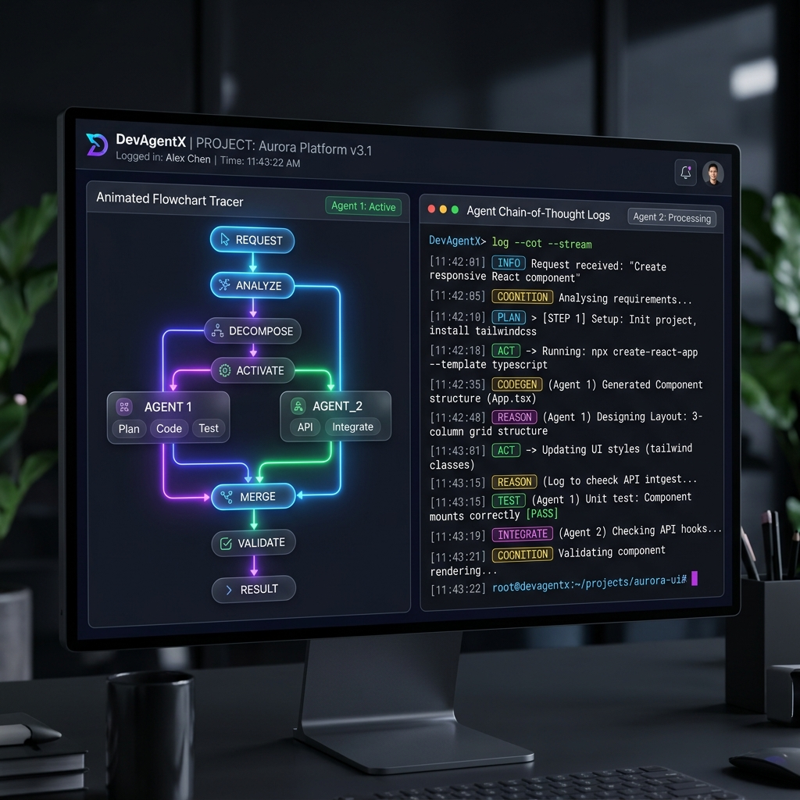
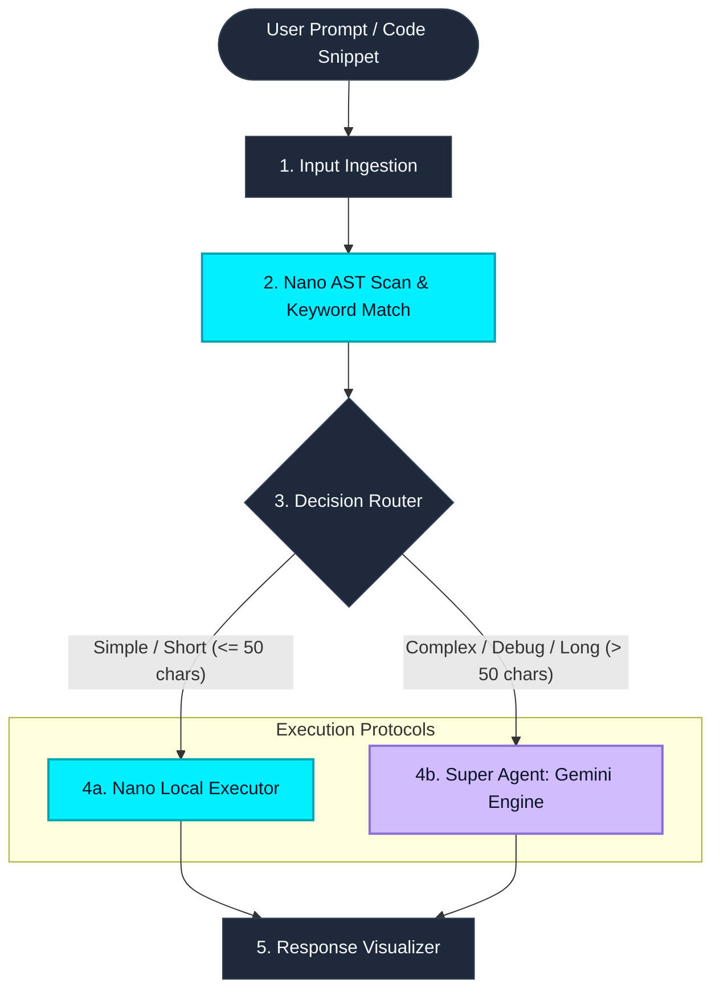

# 🤖 DevAgentX – Agentic Developer Copilot

DevAgentX is an advanced, AI-powered agentic developer assistant built on a hybrid **Super + Nano Architecture**. Inspired by NVIDIA Nemotron-3's routing principles, DevAgentX classifies incoming developer tasks locally, routes them intelligently based on complexity, and delivers precise explanations, bug fixes with visual diffs, loop optimizations, and documentation.

---

## 📸 Dashboard Preview



---

## 🎯 The Problem & Our Solution

### The Problem
Traditional AI assistants act as linear chatbots:
1. They execute heavy, expensive LLM calls for simple code queries.
2. They do not separate fast, pattern-based parsing from deep reasoning.
3. They hide the internal agent routing path from the developer, offering no transparency.

### Our Solution
**DevAgentX** introduces a multi-tier agent router:
- **Nano Agent (Local, ~15ms)**: Parses simple instructions, short templates, and basic operations locally.
- **Router Agent (Classifier)**: Decides whether to route the request to the fast Nano engine or escalate it.
- **Super Agent (Reasoning, Gemini SDK / Chain-of-Thought)**: Evaluates complex logic anomalies, algorithmic bottlenecks, and full-repository scans, outputting step-by-step reasoning logs and unified patches.

---

## 🧩 Architecture Flow



---

## 🔥 Key Features

1. **Live Decision Routing Tracer**:
   - An animated SVG path mapping flow that traces the execution route from task ingestion to the final active agent core.
2. **Multi-Agent Decision Routing**:
   - Task classification rules route queries to Nano or Super agents instantly depending on the request type and complexity.
3. **Automated Bug Detection & Patch Generator**:
   - Scans code for issues (e.g. recursion without base limits, off-by-one errors) and renders a visual, color-coded unified Git patch comparison.
4. **Code Explainer & Optimizer**:
   - Provides line-by-line structural explanations and converts $O(N^2)$ quadratic nested loops into $O(N)$ linear implementations.
5. **Interactive Follow-up Chat**:
   - Ask clarifying or follow-up questions to discuss the agent's logic in real-time.
6. **Dual Theme Modes**:
   - Crisp light and premium dark themes with persistent storage states and carefully balanced contrast ratios.

---

## ⚙️ Routing Protocol Rules

The routing engine classifies and directs incoming tasks using the following logic:

```javascript
// Decision Routing Rules
if (task === "debug" || codeLength > 50 || containsErrorKeywords) {
    route = "super"; // Escalated to Gemini / Heavy Reasoning Engine (VIOLET-PROTOCOL)
} else {
    route = "nano";  // Executed locally in ~15ms via AST parsing rules (CYAN-PROTOCOL)
}
```

---

## 🛠️ Technology Stack

- **Frontend**: React.js (Vite, Tailwind CSS, Lucide Icons, Material Symbols)
- **Backend**: Node.js, Express, CORS
- **AI Engine**: Google Gemini API SDK (`@google/generative-ai`) with high-fidelity local fallback simulations

---

## 🚀 Getting Started

### 📋 Prerequisites
- **Node.js** (v18.x or higher)
- **npm** or **yarn**

### ⚙️ Installation & Setup

1. **Clone the repository**:
   ```bash
   git clone <repository-url>
   cd devagentx
   ```

2. **Setup Backend API**:
   ```bash
   cd backend
   npm install
   ```
   Create a `.env` file in the `backend/` directory:
   ```env
   PORT=5000
   GEMINI_API_KEY=your_gemini_api_key_here
   ```
   *Note: If no API key is specified, the server automatically defaults to a high-fidelity mock simulation mimicking Gemini's output and reasoning steps.*

   Start the backend development server:
   ```bash
   npm run dev
   ```

3. **Setup Frontend Client**:
   ```bash
   cd ../frontend
   npm install
   ```
   Start the frontend client dev server:
   ```bash
   npm run dev
   ```

4. **Access the application**:
   Open your browser and navigate to `http://localhost:5173`.

---

## 🔬 Running Tests

DevAgentX includes integration and live-server test suites to verify task classification and routing accuracy:

- **Run Routing Rules Test**:
  ```bash
  cd backend
  node test-endpoints.js
  ```
- **Run Live API Server Integration Test**:
  ```bash
  cd backend
  node test-live-server.js
  ```

---

## 📂 Project Structure

```
devagentx/
├── backend/
│   ├── agents/
│   │   ├── nano.js            # AST-based lightweight local handler
│   │   ├── router.js          # Task router and complexity evaluator
│   │   └── super.js           # Gemini API Integration
│   ├── routes/
│   │   └── api.js             # API endpoint definitions
│   ├── server.js              # Express app initialization
│   ├── test-endpoints.js      # Offline test suite
│   └── test-live-server.js    # Live API verification script
├── frontend/
│   ├── src/
│   │   ├── components/
│   │   │   ├── ArchitectureView.jsx  # SVG routing tracer
│   │   │   ├── SettingsView.jsx      # Threshold adjustments & API keys
│   │   │   ├── Topbar.jsx            # Dynamic diagnostic & theme controls
│   │   │   └── WorkspaceView.jsx     # Main workspace editor & chat panel
│   │   ├── App.jsx            # App state manager
│   │   ├── index.css          # CSS styles & Theme configurations
│   │   └── main.jsx           # Entry point
│   ├── tailwind.config.js     # Custom color overrides & animations
│   └── vite.config.js         # Vite builder setup
└── docs/
    └── images/
        └── dashboard.png      # Dashboard preview image
```
